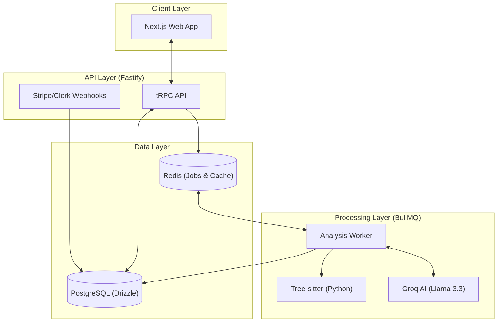

# CodeSage 🧙‍♂️

<p align="center">
  
</p>

> **The AI-Powered Code Optimization & Analysis Engine**

CodeSage is a production-grade SaaS platform designed to transform code quality. It leverages advanced AST (Abstract Syntax Tree) parsing and Large Language Models to analyze, refactor, and optimize code with surgical precision.

---

## ✨ Key Features

- **🌳 Deep AST Analysis**: Uses `tree-sitter` for structural understanding—not just regex. Currently supports **Python** with comprehensive metrics including Cyclomatic and Cognitive complexity.
- **🤖 AI-Driven Refactoring**: Automatically identifies performance bottlenecks and security flaws, generating optimized fixes powered by **Groq (Llama 3.3 70B)**.
- **📊 Complexity Scoring**: Real-time health scores for your codebase (0-100) based on weighted analysis of errors, warnings, and architectural patterns.
- **💬 AI Chat Assistant**: An integrated, context-aware chat interface to discuss code improvements and get instant technical advice.
- **🖥️ IDE-grade Experience**: Built-in **Monaco Editor** (VS Code's engine) with syntax highlighting, line snapping, and interactive diff previews.
- **🚀 Scalable Architecture**: A high-performance monorepo using **Turborepo**, **Fastify**, and **BullMQ** for asynchronous job processing.

---

## 🏗️ System Architecture

CodeSage follows a modern, distributed architecture designed for high throughput and reliability.



### 🛰️ Data Flow — Analysis Lifecycle

1.  **Submission**: User pastes code in the **Next.js** frontend.
2.  **Queueing**: The **Fastify** API validates the request and pushes an analysis job to **Redis** via **BullMQ**.
3.  **AST Pass**: The **Worker** picks up the job and runs a specialized **Tree-sitter** pass to extract structural metadata and complexity metrics.
4.  **AI Analysis**: The worker orchestrates a call to **Groq**, providing it with the code and AST context for semantic review.
5.  **Refactoring**: If issues are found, the AI generates a "fixable" optimized version.
6.  **Persistence**: Results (issues, fixes, scores) are saved to **PostgreSQL** using **Drizzle ORM**.
7.  **Real-time Update**: The frontend polls (or is notified) and renders the results with interactive diffs.

---

## 🛠️ Tech Stack

### Frontend
- **Framework**: [Next.js 16](https://nextjs.org/) (App Router, React 19)
- **Styling**: [Tailwind CSS v4](https://tailwindcss.com/)
- **State Management**: [Zustand](https://github.com/pmndrs/zustand) & [TanStack Query](https://tanstack.com/query)
- **Editor**: [Monaco Editor](https://microsoft.github.io/monaco-editor/)
- **Animations**: [Framer Motion](https://www.framer.com/motion/)
- **Auth**: [Clerk](https://clerk.dev/)

### Backend
- **Server**: [Fastify 5](https://www.fastify.io/)
- **Communication**: [tRPC](https://trpc.io/) (End-to-end type safety)
- **Database**: [PostgreSQL](https://www.postgresql.org/) with [Drizzle ORM](https://orm.drizzle.team/)
- **Job Queue**: [BullMQ](https://docs.bullmq.io/) on **Redis**
- **AI Engine**: [Groq](https://groq.com/) (Llama 3.3 70B)
- **Parsing**: [Tree-sitter](https://tree-sitter.github.io/tree-sitter/) (python-tree-sitter)
- **Billing**: [Stripe](https://stripe.com/)

---

## 🚀 Getting Started

### Prerequisites
- [Node.js](https://nodejs.org/) (v18+)
- [pnpm](https://pnpm.io/)
- [Docker](https://www.docker.com/) (for Postgres/Redis)

### Local Setup

1.  **Clone & Install**:
    ```bash
    git clone https://github.com/Samarth305/CodeSage.git
    cd CodeSage
    pnpm install
    ```

2.  **Environment Variables**:
    Copy `.env.example` to `.env` in the root and configure:
    - `DATABASE_URL` (Postgres)
    - `UPSTASH_REDIS_URL` (Redis)
    - `GROQ_API_KEY`
    - `CLERK_SECRET_KEY` & `NEXT_PUBLIC_CLERK_PUBLISHABLE_KEY`
    - `STRIPE_SECRET_KEY`

3.  **Database Migration**:
    ```bash
    pnpm db:generate
    pnpm db:migrate
    ```

4.  **Run Development Servers**:
    ```bash
    pnpm dev
    ```

---

## 📂 Project Structure

```text
CodeSage/
├── apps/
│   ├── web/        # Next.js frontend
│   ├── api/        # Fastify backend & tRPC router
│   └── worker/     # BullMQ analysis worker
├── packages/
│   ├── db/         # Drizzle schema & database client
│   ├── ui/         # Shared component library
│   ├── types/      # Shared TypeScript interfaces
│   └── utils/      # Common helper functions
├── drizzle/        # SQL Migration files
└── turbo.json      # Monorepo configuration
```

---